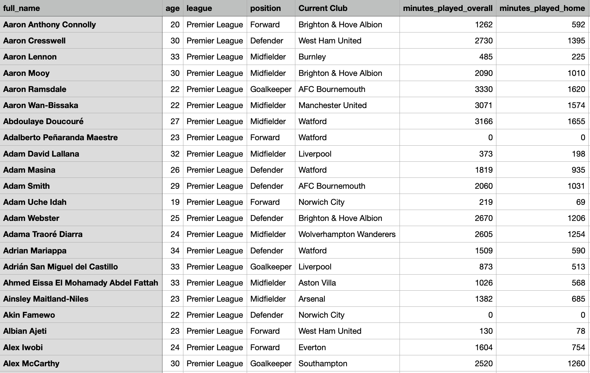
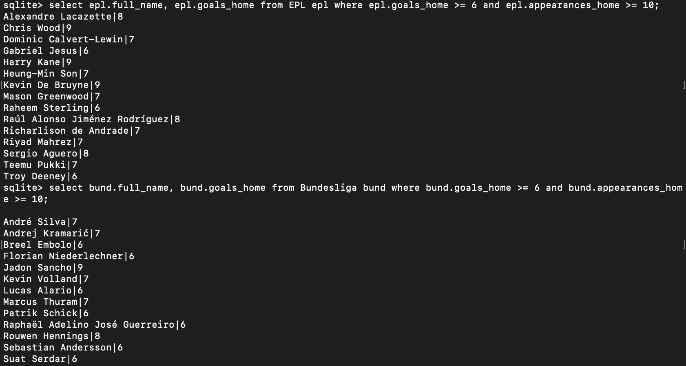

#### Name:
Declan Casey

#### Date:
12/11/2020

### Title: Using Databases to Study The World's Top Goal-Scorers

#### Data set
The five datasets I used were found @ https://footystats.org/download-stats-csv#. The data isn't free, but I had already subscribed for a personal project I was doing so it was no issue.

#### Project Overview
This research project uses databases to study the soccer world's top goal-scorers.  A few questions that I specifically wanted to ask and answer are:

- Which leagues have more players with a high goal tally?
- What advanced metrics that are not direct goal contributions (goals, assists, major stats such as these) contribute to an elite goal-scorer's success?
- What are some stand-out metrics that are unique to individual goal scorers?
- Are there specific offensive stats that most elite goal scorers tend to not be elite in? For example, maybe the data shows most of the top scorers score less in away games or vice versa.
- Do the amount of goals their team conceded in games they played in seem to correlate to how many they score? Does a team's performance affect their individual performance?

##### Motivation
In order to be enthusiastic about the actual results of the research I performed, I tried to pick a field that was genuinely interesting to me. I am a big sports fan, and the world's most elite soccer leagues, commonly referred to as the "Top 5", got underway just under 2 months ago. The top 5 leagues are the Premier League in England, Ligue 1 in France, the Bundesliga in Germany, Serie A in Italy, and La Liga in Spain. These teams have dominated European soccer for decades and contain the vast majority of elite players in the entire world. Studying these leagues will give me better insight about the best goal-scorers more than any others. There are a few other popular leagues, but none that contain the amount of elite players as the Top 5.

One aspect fascinating aspect of modern sports is that they are constantly evolving, whether it's because of rule changes, changes in playing styles over time, or because of players who are so good that they change the way the game is played. Particularly in soccer, there haven't been many rule changes that have drastically affected the way the game is played, but there have been several generational players who have fundamentally changed the way people view the sport, such as Cristiano Ronaldo and Lionel Messi, as well as many changes in playing styles. There are so many different kinds of playing styles that trying to study them all would be too difficult and probably wouldn't come to a specific learning outcome because of the sheer mass of data.

For this project I decided to study attackers only, as there are far more valuable attacking stats than there are defensive stats. Also, judging a defender based off of their individual stats isn't fair to them, as there are no direct defensive stats that clearly show their output on the field. For example, attackers can score a goal or an assist and the more they have of each the more effective they are. Defenders have stats such as tackles and interceptions, but they don't directly show just how effective they are. Also, attacking stats are much more fun!

##### Background Information
It is important to note that although data and statistics are very important in deciding how effective a player is, there are many traits and skills that we have to found a way to quantify statistically. Researchers out of Spain noted one skillset that is hard to quantify is a player's [motor skill](https://www.frontiersin.org/articles/10.3389/fpsyg.2017.00741/full) and they actually began to develop and improve upon previous methods of analyzing motor skills. They developed 50 sub-categories underneath the motor skills main category and used "T-pattern detection and polar coordinate analysis" to make connections and associations between these patterns. Polar coordinate analysis provides a "vector map of interrelated behaviors obtained from prospective and retrospective sequential analysis," and T-Pattern analysis "temporal structures of complex behavioral sequences" using smaller, previous events within specified observation times. These researchers have shown that in order to perform quantifiable research and hard-to-quantify categories is very tedious.


##### References
- Castañer, Barreira, Camerino1*, Anguera, Fernandes, and Raúl Hileno. 2017, "Mastery in Goal Scoring, T-Pattern Detection, and Polar Coordinate Analysis of Motor Skills Used by Lionel Messi and Cristiano Ronaldo," Frontiers of Psychology


##### Building the Database System
There were several important steps in building the database system. The first step was acquiring good, reliable data for each of the top 5 leagues, which was much harder than originally expected. Most of the data that I found did not contain enough advanced statistics, which are a combination of several data points, rather than just a a one-dimensional stat like goals or assists. For example expected goals (xg) is the measure of the quality of a shot based on several variables such as assist type, shot angle, distance from goal, whether it was a header, and whether it was a big chance. There are many important advanced stats in the data that I did end up finding, but this data was not free of charge. Luckily I had already subscribed to the website that held the data due to previous personal research. The dataset I found has at least 1,000 entries per league, which was more than enough and contained up over 40 different columns of data.

The next step was cleaning and filtering the data before building a database file. I deleted about 15-20 attributes that I was not planning on examining, such as defensive stats. There were other categories that I wasn't planning on researching at first, but decided to leave them in as they could have been of later use. The cleaning process was a bit tedious as I had 5 datasets that were quite large, but since they all came from the same source they were all formatted uniformly, which sped up the process.

I decided to use SQLite3 as it was the language and database system that I understood the most, and given that it relies almost entirely on tables, it mimics a top scorers board in the real world. The first table below is what the actual top scorers table looks like, and the second one is how my data is formatted. Although they are not the exact same, they do have similarities.




Another reason for using SQL was the simplicity of querying and database building using a txt file called `soccerStats_build.txt`. The only code of importance outside of the import statements below is the command to run the the builder file, `/* cat soccerStats_build.txt | sqlite3 soccerStatsDB.sqlite3 */`, and also the separator, `.separator ","` which will  separate the data being imported with a comma, `,`. This is because the database will be reading in CSV files where the values are separated by commas rather than tabs, indents, etc.

The next step was figuring out how exactly to read the data in. Since my data came with headers for each column, I decided not to mess with the format too much, and not build individual schemas for each table in the builder file. It was much easier to just import the entire csv files themselves as their own table:

```
.import data/Budesliga-player-stats-1920-final.csv Bundesliga
.import data/EPL-player-stats-1920-final.csv EPL
.import data/LaLiga-player-stats-1920-final.csv LaLiga
.import data/Ligue1-player-stats-1920-final.csv Ligue1
.import data/SerieA-player-stats-1920-final.csv SerieA
```

###### Tables & Schema
The database building process went very smoothly and all of my tables and schemas were set up correctly and contained all of the correct information. Again, there are five tables in my database one for each of the top 5 leagues. They all contain the same attributes but different amounts of data given that each league has a different amount of players. This means they all have the same schema. Here is an example of the schema of one of my tables, the English Premier League.


#### First Research Question and Background
How many attackers in each league have elite assist numbers relative to their position? This is an interesting question to ask in my opinion because assists are generally an important stat for an attacker, but not necessarily for all attackers. As mentioned earlier, there are many different kinds of playing styles for each individual position. While many attackers are out-and-out strikers whose main job is to score goals, there are also many attackers who are better at making plays for their teammates rather than scoring themselves. I decided that an elite assist total for an attacker would be at least 5 as, again attackers main job is not typically to assist, so using a number like 7 would be too high of an expectation and only show extreme outliers.

##### Queries
```
select epl.full_name, epl.assists_overall from EPL epl where epl.assists_overall >= 5 and epl.position == "Forward";
select bund.full_name, bund.assists_overall from Bundesliga bund where bund.assists_overall >= 5 and bund.position == "Forward";
select liga.full_name, liga.assists_overall from LaLiga liga where liga.assists_overall >= 5 and liga.position == "Forward";
select ligue1.full_name, ligue1.assists_overall from Ligue1 ligue1 where ligue1.assists_overall >= 5 and ligue1.position == "Forward";
select serie.full_name, serie.assists_overall from SerieA serie where serie.assists_overall >= 5 and serie.position == "Forward";

```

##### Results
The results below confirm several pre-existing trains of thought generally about playmaking attackers, as well as specific playmaking attackers. There are only a few attackers who recorded more than 8 assists, and the majority of them are some of the already established, historic great playmaking attackers, such as Alexis Sanchez, Luis Suarez, Karim Benzema, and Roberto Firmino. Rather than shedding light on new ideas, this query confirms previously record individual trends, as well as demonstrate that very few attackers are also elite playmakers.


#### Second Research Question and Background
Which leagues have more players with the higher amount of goals involved in per 90 minutes(GIp90)? GIp90 counts the amount of goals and assists a player averages every 90 minutes, the length of a full soccer match. This stat is telling because it shows what a player would produce if they played the whole game. Players with a high GIp90 demonstrate the ability to both score and assist goals for their team.

##### Queries
```
select count(epl.full_name) from EPL epl where epl.goals_involved_per_90_overall >= 1;
select count(bund.full_name) from Bundesliga bund where bund.goals_involved_per_90_overall >= 1;
select count(liga.full_name) from LaLiga liga where liga.goals_involved_per_90_overall >= 1;
select count(ligue1.full_name) from Ligue1 ligue1 where ligue1.goals_involved_per_90_overall >= 1;
select count(serie.full_name) from SerieA serie where serie.goals_involved_per_90_overall >= 1;
```

##### Results
From the image below we can see that the German Bundesliga has 14 players with a higher GIp90, 3 more than the league in second, the Serie A in Italy, and 8 more than the English Premier League which came in last place. There are several noteworthy discoveries here, the first being that the Serie A has the second highest total of players with a GIp90 greater than 1. Italy is know for being "the most tactical and defensive of the major European leagues" (Kharosekar). When we look at the images below, this data point shows the complete opposite, but makes sense given that for this particular season players like Cristiano Ronaldo, Ciro Immobile, and Duvan Zapata all had terrific years.


- https://towardsdatascience.com/which-is-the-most-exciting-soccer-league-in-europe-529c6639e84a


#### Third Research Question and Background
Which leagues have more players with the higher amount of goals per 90 overall(Gp90) whilst having played at least 900 minutes(ten games)? This question is a bit more encapsulating than the last two, as it rules out players who haven't played at least 10 games. In the previous queries we can see that certain players had incredibly high numbers, for instance Amad Traore having neared 4 goal involvements per 90. These outliers occur because they might have only played a few games and done very well in those games. Including a minimum helps demonstrate how players maintained their form of the length of the season.

##### Queries
```
select epl.full_name, epl.goals_per_90_overall from EPL epl where epl.goals_per_90_overall >= .3 and epl.minutes_played_overall >= 900;

select bund.full_name, bund.goals_per_90_overall from Bundesliga bund where bund.goals_per_90_overall >= .3 and bund.minutes_played_overall >= 900;

select liga.full_name, liga.goals_per_90_overall from LaLiga liga where liga.goals_per_90_overall >= .3 and liga.minutes_played_overall >= 900;

select ligue1.full_name, ligue1.goals_per_90_overall from Ligue1 ligue1 where ligue1.goals_per_90_overall >= .3 and ligue1.minutes_played_overall >= 900;

select serie.full_name, serie.goals_per_90_overall from SerieA serie where serie.goals_per_90_overall >= .3 and serie.minutes_played_overall >= 900;
```

##### Results
From the image below we can immediately notice how much of a difference it makes filter with a minimum minutes played boundary. What this stat gives is now an elite tier of players who scored at least a goal every 3 games they played. The 2 players with the highest Gp90 are Olivier Giroud with 0.72 and Loic Remy with 0.65. To give some context, both of these players are backups or second strings. The data doesn't show this but from my knowledge of the sport, I know Giroud battled for a starting sport throughout the season, while Remy was an out-and-out backup. However, since this is per 90 minutes measure, their status as a backup doesn't matter; they ranked among the top in the world in goals scored per 90, even though they weren't the preferred starter.


#### Fourth Research Question and Background
What players have a high amount of goals scored away from home with at least 11 games played away from home? As a player, it is typically much easier to score when the fans are cheering for you rather than against you. Being able to score away from home while rival fans are booing you shows a mental fortitude only certain elite attackers have.

##### Queries
```
select epl.full_name, epl.goals_away from EPL epl where epl.goals_away >= 6 and epl.appearances_away >= 10;
select bund.full_name, bund.goals_away from Bundesliga bund where bund.goals_away >= 6 and bund.appearances_away >= 10;
select liga.full_name, liga.goals_away from LaLiga liga where liga.goals_away >= 6 and liga.appearances_away >= 10;
select ligue1.full_name, ligue1.goals_away from Ligue1 ligue1 where ligue1.goals_away >= 6 and ligue1.appearances_away >= 10;
select serie.full_name, serie.goals_away from SerieA serie where serie.goals_away >= 6 and serie.appearances_away >= 10;
```


##### Results
The results of this query are a bit more expected than previous ones. I chose a minimum of 6 goals scored away from home, because any less than 6 goals and I queried too many results, leading me to believe less than 6 was not an elite statistic. I chose 10 appearances as a baseline because every team plays 19 games away from home, so a player who has played about half of those away games seemed to be the right minimum to me. What we see below is a fairly even spread between 6 and 9 goals scored away from home. One thing to note is that several of the players who scored 9 goals away from home are the captains of their team, showing that mental fortitude is in fact an important factor in being able to score many goals in front of away fans. These players are Raul García of Athletic Bilbao in Spain, Cristiano Ronaldo of Juventus in Italy, Pierre-Emerick Aubameyang of Arsenal in England, and Harry Kane of Tottenham in England.


#### Fifth Research Question and Background
What players have a high amount of goals scored at from home with at least 11 games at home? This question is the opposite of the previous one, as I want to now look and see if any of the same players who did really well away from home also do really well AT home. The logical assumption would be yes, of course a player will play better in front of their own fans, especially if they play well in front of booing fans. However, using logic to make decisions in sports often times fails.

##### Queries
```
select epl.full_name, epl.goals_home from EPL epl where epl.goals_home >= 6 and epl.appearances_home >= 10;
select bund.full_name, bund.goals_home from Bundesliga bund where bund.goals_home >= 6 and bund.appearances_home >= 10;
select liga.full_name, liga.goals_home from LaLiga liga where liga.goals_home >= 6 and liga.appearances_home >= 10;
select ligue1.full_name, ligue1.goals_home from Ligue1 ligue1 where ligue1.goals_home >= 6 and ligue1.appearances_home >= 10;
select serie.full_name, serie.goals_home from SerieA serie where serie.goals_home >= 6 and serie.appearances_home >= 10;
```

##### Results
Similar to the last question, there is again a fairly even spread between those who scored 6 goals at home and those who scored 9. There are several overlapping players between this query and the last one, meaning those players tend to do very well no matter where they play. A few of these players are Sergio Aguero for Manchester City in England, Richarlison for Everton in England, Sebastian Andersson for Koln in Germany, and Andrea Belotti for Torino in Italy. The one player who stands out among the rest however, is Harry Kane who is the only player to score 9 goals both on the road and at home. Harry Kane is widely regarded as one of the top 3 strikers in the world, along with other players who appear in this list such as Sergio Aguero and Robert Lewandowski. What makes Kane's stat even more impressive, is that Harry Kane was struggling with injuries throughout that season, another variable that can't quite be quantified perfectly, yet still managed to outperform nearly every attacker both on the road and at home.




##### Conclusion

Throughout this project, I have explored and researched different attributes that show clear success for attackers in the top 5 soccer leagues in the world. From the  research we have concluded there are a number of attribute that not only show clear statistical success, but also convey parts of a players character and on-field mentality. In addition, different kinds of player have shown success in different statistical categories, based off of their style of play. In conclusion, using my SQLite3 database and data from the internet, I found a number of factors that have answered why certain stats can convey more meaning than others, as well as why certain stats mean less when given context.
